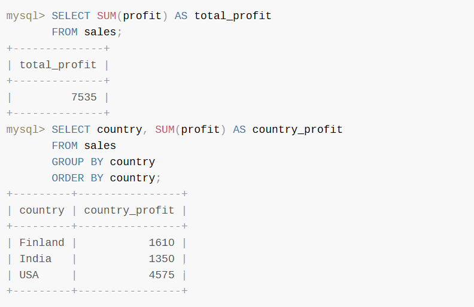
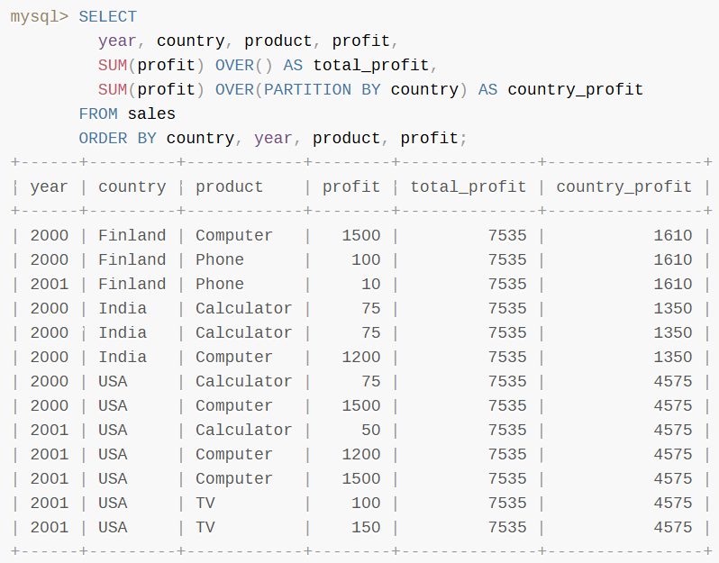
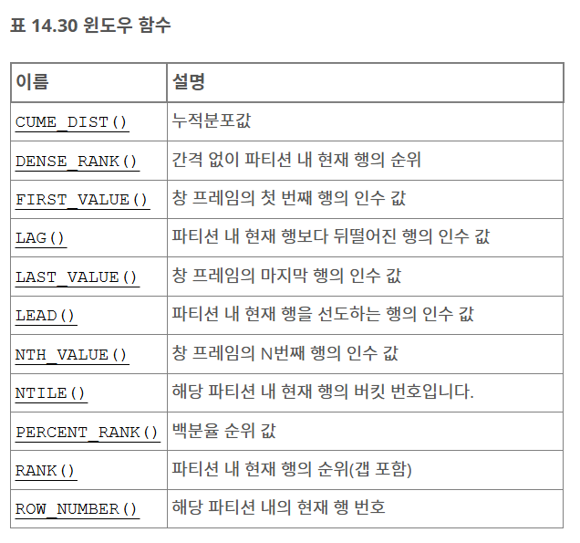
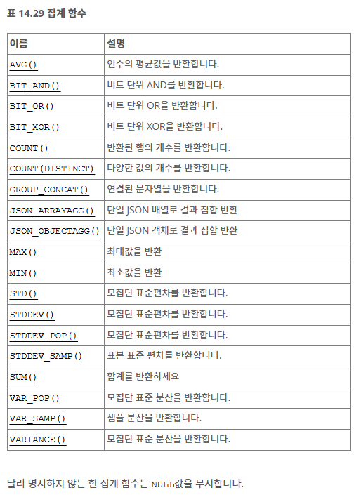

# 📖 MYSQL 공식문서 정리
## 윈도우 함수
### 14.20.2
- 쿼리 행 집합에 대해 집계 연산, 근데 집계 연산과는 다름
    - 집계 연산: 쿼리 행을 단일 결과 행으로 그룹화
    - 윈도우 함수: 각 쿼리 행에 대한 결과


```
AVG()
BIT_AND()
BIT_OR()
BIT_XOR()
COUNT()
JSON_ARRAYAGG()
JSON_OBJECTAGG()
MAX()
MIN()
STDDEV_POP(), STDDEV(), STD()
STDDEV_SAMP()
SUM()
VAR_POP(), VARIANCE()
VAR_SAMP()
```



